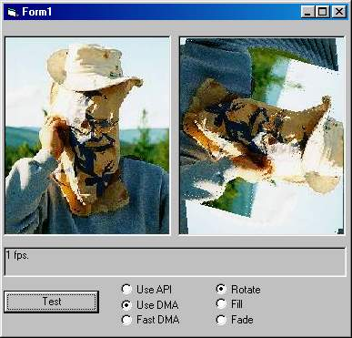



## Fast Graphics with Direct Memory Access \(DMA\)

### Description

Graphical operations are amoung the slowest and most cpu intensive tasks a program can do. Using API calls over the native VB Methods can increase speed by several times, but you can get even better performance with Direct Memory Access (DMA).

This project encapsulates DMA operations into a simple ActiveX DLL which converts a stdPicture object into an array. You then manipulate the array to change the picture.
 
### More Info
 

             |
---                |---
**Submitted On**   |2002-05-01 11:19:16
**By**             |[Bill Soo](https://github.com/Planet-Source-Code/PSCIndex/blob/master/ByAuthor/bill-soo.md)
**Level**          |Advanced
**User Rating**    |5.0 (20 globes from 4 users)
**Compatibility**  |VB 5\.0, VB 6\.0
**Category**       |[Graphics](https://github.com/Planet-Source-Code/PSCIndex/blob/master/ByCategory/graphics__1-46.md)
**World**          |[Visual Basic](https://github.com/Planet-Source-Code/PSCIndex/blob/master/ByWorld/visual-basic.md)
**Archive File**   |[Fast\_Graph78172512002\.zip](https://github.com/Planet-Source-Code/bill-soo-fast-graphics-with-direct-memory-access-dma__1-34297/archive/master.zip)

